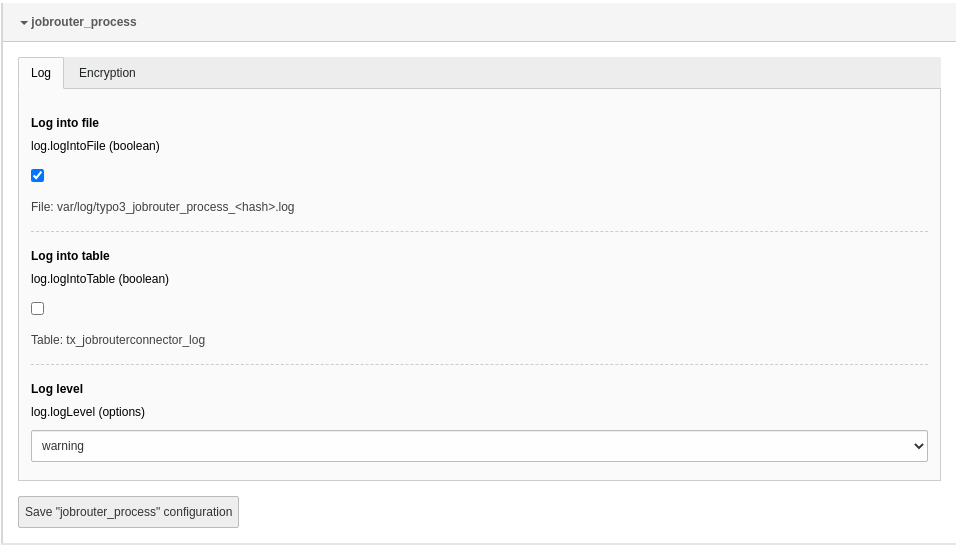

.. include:: _includes.txt

.. highlight:: shell

.. _configuration:

=============
Configuration
=============

Target group: **Administrators**

.. _configuration-extension:

Extension Configuration
=======================

To configure the extension, go to :guilabel:`Admin Tools` > :guilabel:`Settings`
> :guilabel:`Extension Configuration` and click on the :guilabel:`Configure
extensions` button. Open the :guilabel:`jobrouter_process` configuration:

   Options in the extension configuration

log.logIntoFile
---------------

If this option is activated, the log output is written to the file
:file:`var/log/typo3_jobrouter_process_<hash>.log` (for Composer-based
installations). It is enabled by default.

log.logIntoTable
----------------

Activate this option to log into the table `tx_jobrouterconnector_log`. It is
disabled by default.

.. hint::

   To display the log entries of this table in the TYPO3 backend, install the
   extension `vertexvaar/logs <https://github.com/vertexvaar/logs>`_.

log.logLevel
------------

Using the drop down menu you can select the log level for the activated log
options. :guilabel:`warning` is selected by default.

.. _configuration-commands:

Commands
========

Surely you want to execute the commands regularly. Simply set up cron jobs that
will execute the commands regularly, e.g. once an hour or once a day, depending
on your needs.

.. _configuration-start-command:

Starting instances
------------------

If you rely on the :ref:`form finisher <form-finisher>` or use the
:ref:`transfer table <developer-start-instance>` directly to start
instances in JobRouter installations, you have to use the start command:

::

   vendor/bin/typo3 jobrouter:process:start

In general you should receive a successful answer:

::

   [OK] 18 transfer(s) started successfully

If an error occurs, the command issues a warning:

::

   [WARNING] 4 out of 11 transfer(s) had errors on start

Other transfer starts are not affected by an error in one start. According
to your :ref:`logging configuration <configuration-extension>`, the error is
also logged.

.. note::

   Only one start command can run at a time. If the command starts while
   another is in progress, the second command is terminated and a warning
   is displayed.
