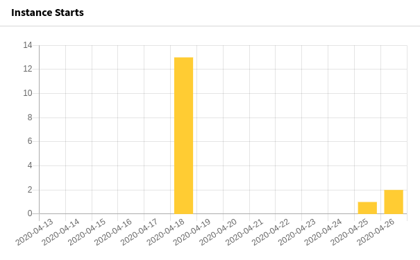
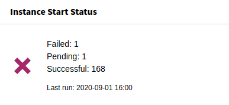

.. include:: _includes.rst.txt

.. _dashboard-widgets:

=================
Dashboard widgets
=================

Target group: **Editors, Integrators, Administrators**

.. contents:: Table of Contents
   :depth: 1
   :local:

With the :ref:`dashboard <ext_dashboard:introduction>` system extension installed,
some widgets can be used to display process statistics. You can find them in the
:guilabel:`Add widget` wizard on the :guilabel:`JobRouter` tab:

.. figure:: _images/dashboard-add-widget.png
   :alt: Add JobRouter widgets
   :class: with-border

   Add JobRouter widgets

The widgets are based on the transfer table. All entries are considered -
successfully started, pending and erroneous entries. Prerequisite for meaningful
data is the availability of types in this transfer table - either configured in
:ref:`form definitions <form-finisher>` or :ref:`coded in PHP
<developer-start-instance>`.

.. note::
   The available widgets for a user depend on the
   :ref:`access rights <ext_dashboard:permission-handling-of-widgets>`.

.. _dashboard-widget-instance-starts:

Instance starts
===============

The number of instance starts per day can be displayed visually with a dashboard
widget:

   Instance Starts widget

By default, the last 14 days (included the current day) are shown. This can be
:ref:`adjusted <configuration-dashboard>` to your needs.

.. _dashboard-widget-instance-start-types:

Instance start types
====================

The instance starts for different types can be visually displayed with this
widget:

.. figure:: _images/dashboard-widget-instance-start-types.png
   :alt: Instance Start Types widget
   :class: with-border

   Instance Start Types widget

By default, the last 14 days (included the current day) are shown. This can be
:ref:`adjusted <configuration-dashboard>` to your needs.

Instance start status
=====================

The status of the instance starts can be shown with this widget:

   Instance Start Status widget

Instance start errors
=====================

If errors occur when starting an instance, they can be displayed with this widget:

.. figure:: _images/dashboard-widget-instance-start-error.png
   :alt: Instance Start Error widget
   :class: with-border

   Instance Start Errors widget
