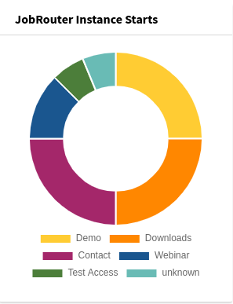

.. include:: _includes.txt

.. _dashboard:

=================
Dashboard Widgets
=================

Target group: **Editors, Integrators, Administrators**

.. contents:: Table of Contents
   :depth: 1
   :local:

With the `Dashboard <https://docs.typo3.org/c/typo3/cms-dashboard/master/en-us/>`_
system extension installed, some widgets can be used to display process
statistics. You can find them in the :guilabel:`Add widget` wizard on the
:guilabel:`JobRouter` tab:

.. figure:: _images/dashboard-add-widget.png
   :alt: Add JobRouter widgets

   Add JobRouter widgets

.. _dashboard-instance-starts:

Instance Starts
===============

The instance starts for different types can be visually displayed with this
widget. These are based on the transfer table. All entries are considered -
successfully started and erroneous entries. Prerequisite for meaningful data is
the availability of types in this transfer table - either configured in
ref:`form definitions <form-finisher>` or ref:`coded in PHP
<developer-start-instance>`.

   Instance Start widget

The time span depends on the :ref:`clean up of the old data
<configuration-cleanuptransfers-command>`.
