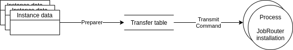

.. include:: _includes.txt

.. _developer:

================
Developer corner
================

Target group: **Developers**

.. contents:: Table of Contents
   :depth: 3
   :local:

.. _developer-start-instance:

Start instances
===============

Sometimes it is necessary to start instances in a JobRouter®
installation programmatically. An API and a :ref:`start command
<command-start>` are available for this use case.

Instances are started asynchronously when submitting a form and using the
:ref:`form finisher <form-finisher>` since a JobRouter® installation may be
unavailable or in maintenance mode and to avoid long page loads. Let's take a
look at the flow:

   Transferring data sets

As you can see from the diagram, you can prepare multiple instances. The
different instances can be started on different JobRouter® installations –
depending on the configuration of the step link in the
:ref:`Process module <module>`.

.. _developer-preparer:

Preparing the instance data
---------------------------

If you want to start instances programmatically in a JobRouter® installation,
you can use the :php:`Preparer` class within TYPO3, e.g. in an Extbase
controller:

::

   <?php
   declare(strict_types=1);

   namespace Vendor\Extension\Controller;

   use Brotkrueml\JobRouterProcess\Domain\Model\Transfer;
   use Brotkrueml\JobRouterProcess\Domain\Repository\StepRepository;
   use Brotkrueml\JobRouterProcess\Exception\PrepareException;
   use Brotkrueml\JobRouterProcess\Transfer\Preparer;
   use TYPO3\CMS\Extbase\Mvc\Controller\ActionController;

   final class MyController extends ActionController
   {
      private Preparer $preparer;
      private StepRepository $stepRepository;

      // It's important to use dependency injection to inject all necessary
      // dependencies
      public function __construct(
         Preparer $preparer,
         StepRepository $stepRepository
      ) {
         $this->preparer = $preparer;
         $this->stepRepository = $stepRepository;
      }

      public function myAction()
      {
         // ... some other code

         // First get the step link uid from the step handle.
         // It is advised to use the handle because the step link uid can differ
         // from development to production system (it is an auto increment).
         $step = $this->stepRepository->findOneByHandle('your_step_handle');

         // Define the transfer domain model with your parameters
         // Have a look in the Transfer model to see the available setters
         $transfer = new Transfer();
         $transfer->setStepUid($step->getUid());
         $transfer->setType('Demo');
         $transfer->setSummary('My summary');
         $transfer->setProcesstable([
            'name' => 'John Doe',
            'company' => 'Acme Ltd.',
            'email_address' => 'jdoe@example.com',
            'message' => 'Please send me information.',
         ]);

         try {
            $this->preparer->store($transfer);
         } catch (PrepareException $e) {
            // On errors an exception can be thrown
            var_dump($e->getMessage());
         }

The :ref:`start command <command-start>` must be activated with a
cron job to periodically start instances in the JobRouter® installation(s).

Instead of the :php:`Preparer` class, you can also use the
:php:`Brotkrueml\JobRouterProcess\Domain\Repository\TransferRepository` to store
transfer records in the database.

.. _developer-variable-resolvers:

Writing own variable resolvers
==============================

With :ref:`variables <form-finisher-variables>` it is possible to add
information to a process start which is resolved when submitting a form. This
extension ships some variable resolvers already, e.g. for translation or
language information.

You can write your own variable resolvers dependent on your needs. Variable
resolvers are implemented as :ref:`PSR-14 event listeners
<t3api:EventDispatcher>`.

The event listener receives the event
:php:`Brotkrueml\JobRouterProcess\Event\ResolveFinisherVariableEvent`. It
provides the following methods:

.. option:: getFieldType(): int

Get the field type, like ``1`` for text or ``2`` for int. Have a look in the
class :php:`Brotkrueml\JobRouterProcess\Enumeration\FieldTypeEnumeration`
for the available field types.

.. option:: getValue(): string

Get the current value of the field. One or more variables can be defined inside.

.. option:: setValue(string $value): void

Set the new value after resolving one or more variables.

.. option:: getTransferIdentifier(): string

Get the current transfer identifier.

.. option:: getFormValues(): array

Get the form values, e.g. :php:`['company' => 'Acme Ltd.', 'name' => 'John Smith']`.

.. option:: getRequest(): \\Psr\\Http\\Message\\ServerRequestInterface

Get the current request.

.. hint::

   Some variable resolvers are already shipped with the extension. Have a look
   into the folder :file:`Classes/Domain/VariableResolver` for implementation
   details.

Example
-------

As an example we want to resolve a variable to a cookie value.

.. rst-class:: bignums-xxl

#. Create the event listener

   ::

      <?php
      declare(strict_types=1);

      namespace YourVender\YourExtension\EventListener;

      use Brotkrueml\JobRouterProcess\Event\ResolveFinisherVariableEvent;
      use Psr\Http\Message\ServerRequestInterface;

      final class TheCookieVariableResolver
      {
         private const COOKIE_NAME = 'the_cookie';
         private const VARIABLE = '{__theCookieValue}';

         public function __invoke(ResolveFinisherVariableEvent $event): void
         {
            $value = $event->getValue();

            if (str_pos($value, self::VARIABLE) === false) {
               // Variable is not available, do nothing
               return;
            }

            $cookies = $event->getRequest()->getCookieParams();

            $variableValue = $cookies[self::COOKIE_NAME] ?? '';
            $value = str_replace(self::VARIABLE, $variableValue, $value);

            $event->setValue($value);
         }
      }

   .. important::

      Variables have to start with `{__`. Otherwise the variable resolvers are not
      called for this value.

#. Register your event listener in :file:`Configuration/Services.yaml`

   .. code-block:: yaml

      services:
         YourVendor\YourExtension\EventListener\TheCookieVariableResolver:
            tags:
               - name: event.listener
                 identifier: 'your-extension/the-cookie-variable-resolver'
                 event: Brotkrueml\JobRouterProcess\Event\ResolveFinisherVariableEvent

