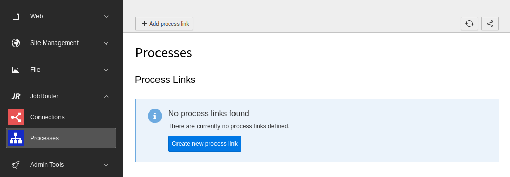
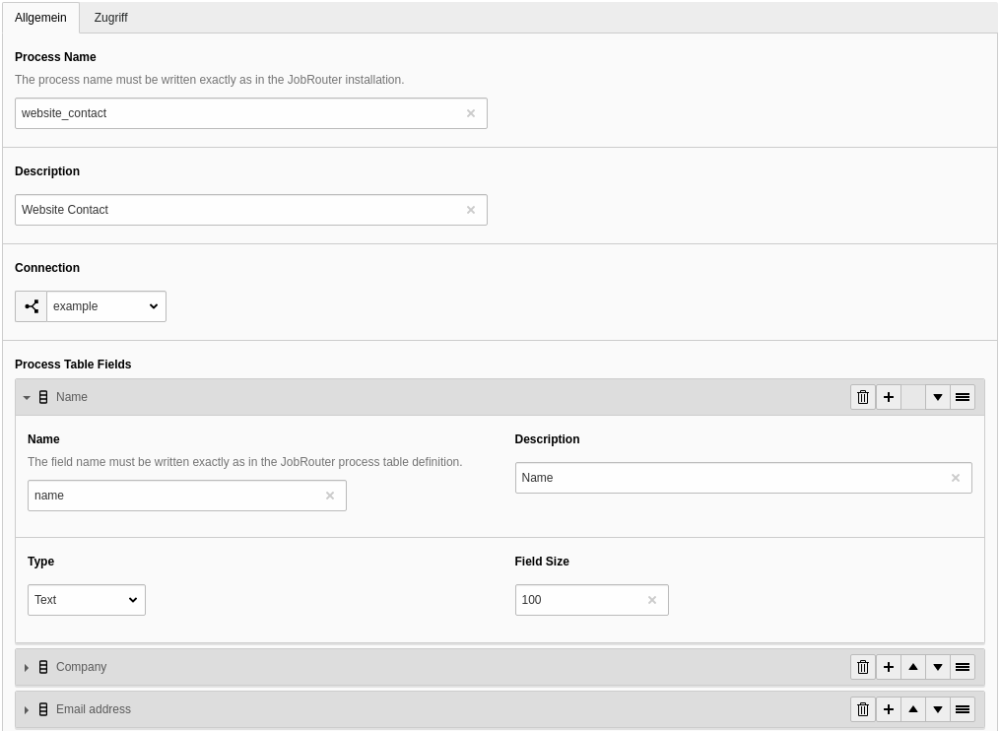
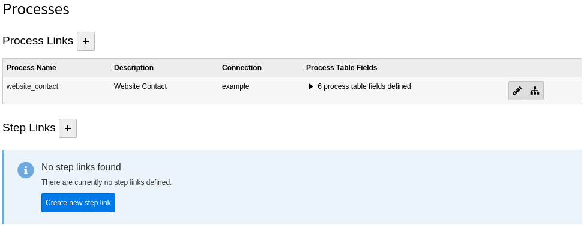
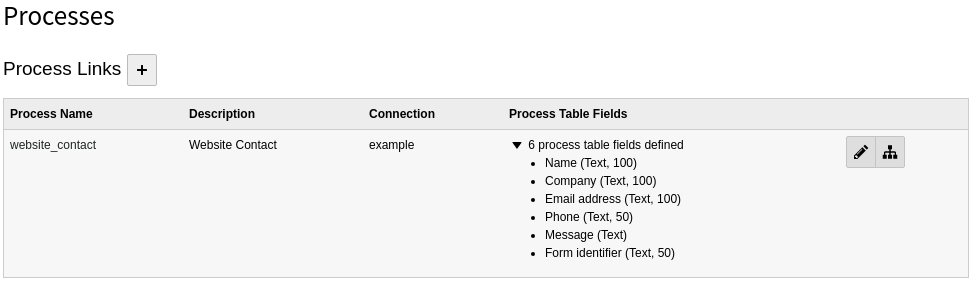
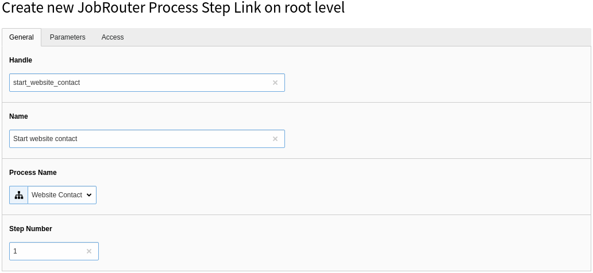
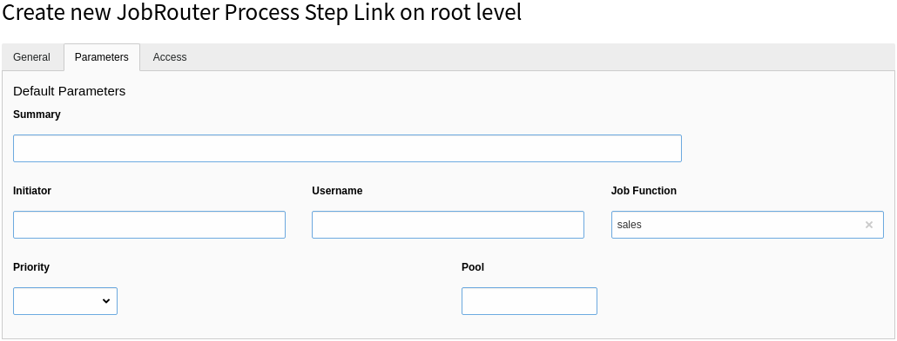

.. include:: _includes.txt

.. _module:

======
Module
======

Target group: **Integrators, Administrators**

.. contents:: Table of Contents
   :depth: 1
   :local:

The links to processes and instances in JobRouter installations are managed in
the module :guilabel:`JobRouter` > :guilabel:`Process`.

On your first visit after installing the extension you will see the following
screen:

   Initial Process module screen

First you have to define a process link. It is the representation of a JobRouter
process. Then configure the instance links you need. These represent the steps
of a process and are used in the form finisher.

.. _module-create-process-link:

Create a Process Link
---------------------

To create a new process link, click the :guilabel:`+` button beside the heading,
which opens a form. Alternatively, you can use the :guilabel:`Create new process
link` button.

   Create a process link

The following fields are available:

General
'''''''

Process Name (required)
   The name of the process as defined in the Process manager of the JobRouter
   installation.

Description (optional)
   A description for the process link.

Connection (required)
   Choose a connection which was defined previously in the :doc:`Connections
   <connector:usage>` module.

Process Table Fields (optional)
   Define the process table fields that should be used when starting an
   instance. Each field item has the following fields:

   Name (required)
      The name of the process table field as defined in the JobRouter Designer.

   Description (optional)
      A description of the process table field.

   Type (required)
      Select the column type (for now are available: `Text`, `Integer`). When
      using the form finisher, the value is casted to this type.

   Field Size (required)
      This option is only shown with type :guilabel:`Text`. Enter the size
      of the field. When :ref:`starting an instance via the transfer table
      <configuration-start-command>` the fields the values are truncated if too
      long to prevent errors when starting an instance. To disable the
      truncation enter `0`.

   .. note::
      Please be sure, that every process table field you use here, has the option
      :guilabel:`Input` enabled to allow the settings of the field from a REST
      resource.

Access
''''''

Enabled
   You can enable or disable the process link. Disabled process links cannot be
   used.

.. _module-process-links-overview:

Process Links Overview
----------------------

After creating one or more process links, you will see an overview of them when
you open the module:

   Overview of available process links

If a process link is not enabled, this is indicated by the addition "(disabled)"
in the process name.

The defined process table fields are not displayed by default, since the list
can be very long. You can display the list of process table fields by clicking
on the count information:

   List of process table fields for a process links

There are two buttons available for each table link:

- You can edit a table link with the pencil. Alternatively click on the handle
  of the process link to open the edit form.
- The second icon is a link to the process of the JobRouter Designer.

The process link records are stored under the root page. You can edit a process
link also inside the :guilabel:`List` module.

As you can see, half of the work is done. Now you have to configure one or more
steps that are used to start an instance.

.. _module-create-step-link:

Create a Step Link
------------------

To create a new step link, click the :guilabel:`+` button beside the heading,
which opens a form. Alternatively, you can use the :guilabel:`Create new step
link` button.

   Create a step link (General)

.. important::
   In JobRouter it is recommended to use a decision step with a routing rule to
   forward the step to the appropriate user or Job Function.

The following fields are available:

General
'''''''

Handle (required)
   A handle for usage in the form finisher. It is unique in the TYPO3
   installation. Only the characters A-Z, a-z, 0-9, - and _ are allowed.

Name (required)
   A descriptive name for the step.

Process name (required)
   Select one of the defined processes out of the list.

Step Number (required)
   Enter the step number of the process.

Parameters
''''''''''

You can define default instance parameters. These are used in the form finisher
when not overridden there.

   Create a step link (Parameters)

Summary
   Enter the default summary for an instance.

Initiator
   Enter the default initiator for an instance.

Username
   Enter the default username which should receive an instance.

Job Function
   Enter the default Job Function which should receive an instance.

Priority
   Select the default priority for an instance.

Pool
   Select the default pool for an instance.

Access
''''''

Enabled
   You can enable or disable the step link. Disabled step links cannot be used.

.. note::
   It can be useful to define the same step multiple times: Imagine, you want
   to configure steps for usage in the form finisher and want to avoid to define
   the same parameters in the form definition over and over again.

.. _module-delete-table:

Delete a Process Link or Step Link
----------------------------------

To delete a record, open the edit page of the process or step link. In the upper
menu bar you will find the :guilabel:`delete` button.
